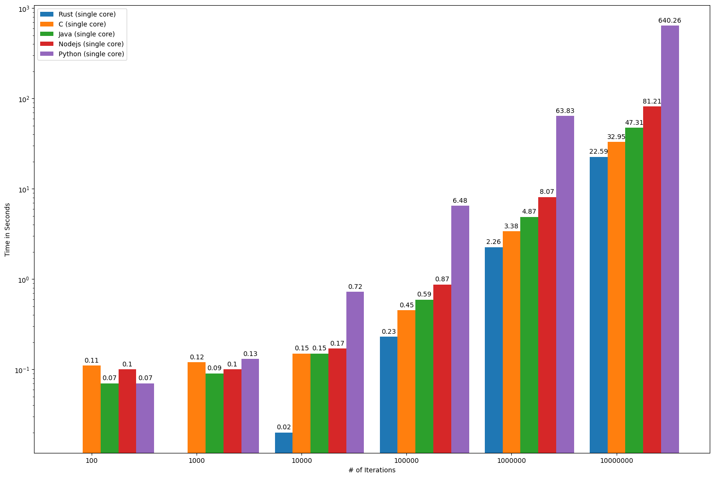
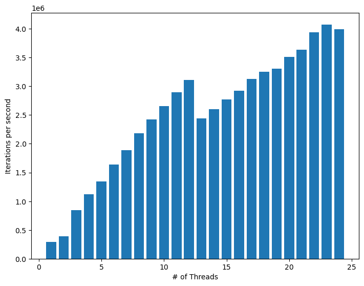
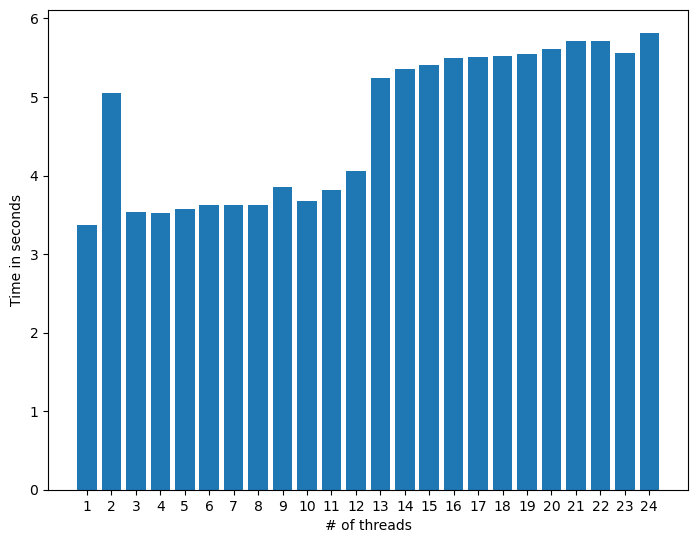

# Single Thread

## Runtime of the algorithm in different languages

    

    

# Multiple threads

## Iterations per second of the algorithm in C with different number of threads

    

    

## Runtime of the algorithm in C with different number of threads and 1000000 iterations per thread

    

    

